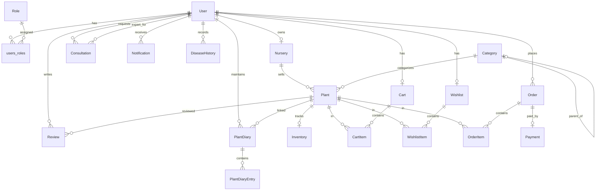

# GoGreen AI – Domain Model & ER Relationships

This document describes the complete database/domain layer for the GoGreen AI backend.

## Package Structure

```
com.gogreen.ai
├── entity/              # JPA entities + enums
├── repository/          # Spring Data JPA repositories
├── dto/
│   ├── request/         # Request DTOs (create/update payloads)
│   └── response/        # Response DTOs (API-safe projections)
└── mapper/              # MapStruct entity ↔ DTO mappers
```

## BaseEntity

All entities extend `BaseEntity` which provides:

| Field       | Type            | Description                    |
|-------------|-----------------|--------------------------------|
| id          | UUID            | Primary key (auto-generated)   |
| createdAt   | LocalDateTime   | Set on insert (JPA auditing)   |
| updatedAt   | LocalDateTime   | Set on insert/update           |

## Enums

| Enum                 | Values                                                                 |
|----------------------|------------------------------------------------------------------------|
| UserRole             | ROLE_USER, ROLE_ADMIN, ROLE_NURSERY, ROLE_EXPERT                       |
| OrderStatus          | PENDING, CONFIRMED, PROCESSING, SHIPPED, DELIVERED, CANCELLED, REFUNDED |
| PaymentStatus        | PENDING, COMPLETED, FAILED, REFUNDED                                   |
| PlantType            | INDOOR, OUTDOOR, SUCCULENT, FLOWERING, HERB, VEGETABLE, FRUIT, BONSAI, MEDICINAL |
| ConsultationStatus   | REQUESTED, SCHEDULED, IN_PROGRESS, COMPLETED, CANCELLED                |
| NotificationType     | ORDER_UPDATE, PAYMENT, CONSULTATION, PLANT_CARE_REMINDER, DISEASE_ALERT, PROMOTION, SYSTEM |
| DiseaseSeverity      | LOW, MODERATE, HIGH, CRITICAL                                          |

## Entity Relationship Diagram



## Relationship Summary

### Identity & Access

| Entity | Relationship | Target | Type | Notes |
|--------|-------------|--------|------|-------|
| User | ManyToMany | Role | LAZY | Join table `users_roles` |
| Nursery | OneToOne | User | LAZY | One nursery per user account |

### Catalog & Inventory

| Entity | Relationship | Target | Type | Notes |
|--------|-------------|--------|------|-------|
| Plant | ManyToOne | Nursery | LAZY | Each plant belongs to one nursery |
| Plant | ManyToOne | Category | LAZY | Hierarchical categories via self-ref |
| Category | ManyToOne | Category | LAZY | Optional parent category |
| Inventory | OneToOne | Plant | LAZY | One inventory record per plant SKU |

### Commerce

| Entity | Relationship | Target | Type | Cascade | Notes |
|--------|-------------|--------|------|---------|-------|
| Cart | OneToOne | User | LAZY | — | One cart per user |
| CartItem | ManyToOne | Cart | LAZY | ALL + orphanRemoval | Unique (cart, plant) |
| CartItem | ManyToOne | Plant | LAZY | — | |
| Wishlist | OneToOne | User | LAZY | — | One wishlist per user |
| WishlistItem | ManyToOne | Wishlist | LAZY | ALL + orphanRemoval | Unique (wishlist, plant) |
| Order | ManyToOne | User | LAZY | — | |
| OrderItem | ManyToOne | Order | LAZY | ALL + orphanRemoval | Snapshot pricing |
| Payment | OneToOne | Order | LAZY | — | One payment per order |

### Engagement & Care

| Entity | Relationship | Target | Type | Notes |
|--------|-------------|--------|------|-------|
| Review | ManyToOne | User, Plant | LAZY | Unique (user, plant) |
| PlantDiary | ManyToOne | User | LAZY | Optional link to marketplace Plant |
| PlantDiaryEntry | ManyToOne | PlantDiary | LAZY | CASCADE ALL + orphanRemoval |
| Consultation | ManyToOne | User (client) | LAZY | |
| Consultation | ManyToOne | User (expert) | LAZY | Expert is also a User |
| Notification | ManyToOne | User | LAZY | |
| DiseaseHistory | ManyToOne | User | LAZY | AI disease detection history |

## Key Constraints

| Table | Constraint | Columns |
|-------|-----------|---------|
| users | UNIQUE | username, email |
| roles | UNIQUE | name |
| nurseries | UNIQUE | user_id |
| categories | UNIQUE | name, slug |
| plants | UNIQUE | nursery_id + sku |
| carts | UNIQUE | user_id |
| cart_items | UNIQUE | cart_id + plant_id |
| wishlists | UNIQUE | user_id |
| wishlist_items | UNIQUE | wishlist_id + plant_id |
| orders | UNIQUE | order_number |
| payments | UNIQUE | order_id, transaction_id |
| reviews | UNIQUE | user_id + plant_id |
| inventories | UNIQUE | plant_id |

## Design Decisions

1. **No circular references** – Relationships are unidirectional from child → parent. Collections (`items`, `entries`) exist only on the aggregate root side (Cart, Order, PlantDiary, Wishlist).

2. **UUID primary keys** – All entities use UUID for distributed-friendly, non-sequential IDs.

3. **LAZY fetching** – All associations use `FetchType.LAZY` to prevent N+1 and session issues.

4. **CascadeType.ALL** – Applied only on parent → child collections where the child has no independent lifecycle (CartItem, OrderItem, WishlistItem, PlantDiaryEntry).

5. **Foreign keys in DTOs** – Request DTOs carry UUID references (e.g. `nurseryId`, `userId`); relationship resolution is deferred to the service layer.

6. **Auditing** – `@EnableJpaAuditing` on the application class; `@CreatedDate` / `@LastModifiedDate` on `BaseEntity`.

## Repositories

Each entity has a corresponding `JpaRepository<Entity, UUID>` with domain-specific query methods (e.g. `findByUserId`, `findBySlug`, `findByNurseryIdAndSku`).

## DTOs & Mappers

- **Request DTOs** – Validated input payloads with foreign-key UUIDs instead of nested entities.
- **Response DTOs** – Flattened output with denormalized names (e.g. `nurseryName`, `plantName`) for client convenience.
- **MapStruct mappers** – Spring component-model mappers; relationship fields are ignored on `toEntity()` and resolved in services.
